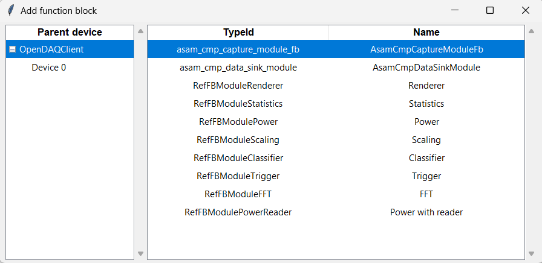
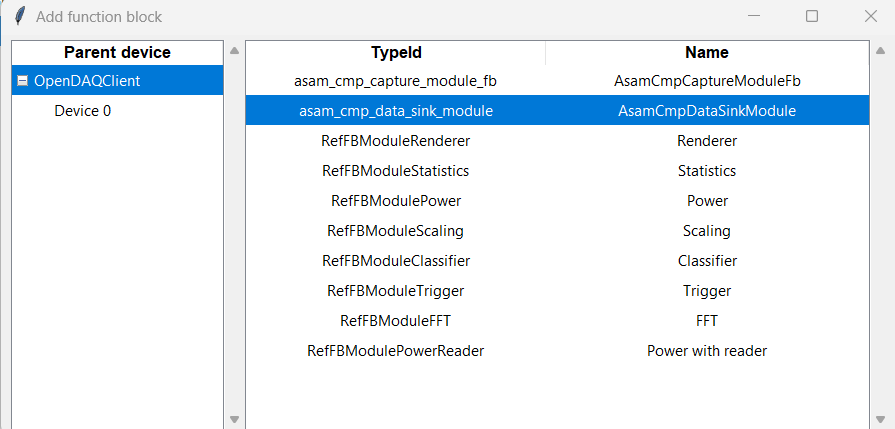
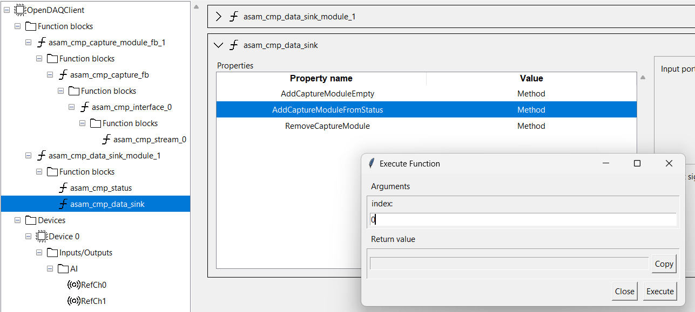

## Introduction
This repository contains the Capture Module function block and the Data Sink function block (FB) that represent the corresponding modules described in the ASAM Capture Module Protocol (ASAM CMP) in the openDAQ ecosystem. ASAM CMP is used to monitor in-vehicle bus communication and sensor data.  
It uses [ASAM CMP Library](https://github.com/openDAQ/ASAM-CMP-Library) to encode and decode CMP Messages.  
It uses [PcapPlusPlus Library](https://pcapplusplus.github.io/) to transport CMP Message with Ethernet frames.

## Features
- Encode openDAQ signals data into ASAM Capture Module Protocol.
- Decode ASAM CMP Data Messages and output decoded data as openDAQ signals.
- Support CAN / CAN-FD and Analog signals.
- Gather information about Capture Modules appearing on the network.

## Required tools before building
 - [CMake 3.24](https://cmake.org/) or higher
 - [Git](https://git-scm.com/)
 - libpcap
    - [Npcap](https://npcap.com/#download) for Windows  
      must be installed in WinPcap API-compatible Mode
    - [libpcap developers pack](https://www.tcpdump.org/#latest-release) for Linux  
      can be installed through a package manager `sudo apt-get install libpcap-dev`
 - Compiler:
   - (msvc) Visual Studio 2017 or higher with installed Workload for C++
   - gcc

## Build the project
You can build Capture Module FB, DataSink FB or both by enabling the following options in CMake: `ASAM_CMP_BUILD_CAPTURE_MODULE`, `ASAM_CMP_BUILD_DATA_SINK`. You can use `ASAM_CMP_BUILD_EXAMPLE` cmake option to build a usage example.    
To compile both modules in Windows using Visual Studio 2022 use command line:
```
cmake -S . -B build -G "Visual Studio 17 2022" -A x64
cmake --build build
```
To compile both modules in Linux use command line:
```
cmake -S . -B build
cmake --build build
```
**Note**:
To allow a process to send/receive packets with libpcap in Linux, you must set the process capabilities to use RAW and PACKET sockets with the command `sudo setcap cap_net_raw,cap_net_admin=eip path_to_the_process`.

## Usage
<details>
 <summary>Detailed description of usage</summary>
 
### CaptureModule
To connect your OpendaqSignal to the Capture module follow the steps below:

   1. Add `asam_cmp_capture_module_fb` function block:  
   

   2. On the `asam_cmp_capture_module_fb` choose the network adapter among the suggested to send ASAM CMP messages through it:  
   

   3. On the `asam_cmp_capture_fb` run *AddInterface* function to add the interface:  
   

   4. On created `asam_cmp_interface` function block choose PayloadType among suggested:  
   

   5. Run *AddStream* function to add stream:  
   

   6. `asam_cmp_stream_fb` has the input port you can connect your signal, capturing data starts immediately:  
   


To get ASAM CMP packets from the Ethernet follow the steps below:

   1. Add `asam_cmp_data_sink_module` function block:  
   

   2. On the `asam_cmp_data_sink_module` choose the network adapter you expect to receive ASAM CMP messages:  
   

   3. There are two ways to configure `asam_cmp_data_sink`:
   - Go to the `asam_cmp_status` FB. In the capture module list you can check the *CaptureModuleList* property which contains list of capture modules whose status messages were captured. Go to the `asam_cmp_data_sink` FB and run *AddCaptureModuleFromStatus*. This function requires index as the parameter, available capture modules are 0-indexed in the *CaptureModuleList* property of `asam_cmp_status`:  
     
     
   Selected capture module will be configured into a similar structure (capture module → interface → stream). Stream will contain OpenDaq signal with decoded ASAM CMP message from the Ethernet:  
   

   - Run *AddCaptureModuleEmpty* function that creates an empty `capture_module_fb` FB. Then repeat steps 3-5 as you do it on the CaptureModule side.

   In case data messages with the correct `deviceId`, `interfaceId`, and `streamId` exist and the payloadType is correct, processing of incoming data messages starts immediately:  
   


   If you want to remove Interface/Stream on CaptureModule or CaptureModule/Interface/Stream on DataSink, you can use the corresponding *Remove* methods.  
   **⚠️IMPORTANT**: Please remember that you should put an *index* of the object that should be removed, not its id. The picture below demonstrates this:  
     
   

   You can find a usage example in the `asam_cmp_example` directory.
</details>

## Modules Structure
Both modules have nested structure and are based on the same set of function blocks, which have the same properties, but different behavior: Capture FB, Interface FB and Stream FB.

### Capture Module Structure
**Note**: For a Capture FB all device IDs must be unique in the network.  
You can add multiple Interface FBs to the Capture FB.  
You can add multiple Stream FBs to the Interface FB.  

<pre>
AsamCmpCaptureModule FB
|  - NetworkAdapters - selection property to select network adapter to send CMP messages to
|  
|-- Capture FB
    |  - DeviceId - integer property with unique device ID
    |  - AddInterface - function property to add Interface FB
    |  - RemoveInterface - function property to remove Interface FB by its index in the function block list
    |  - DeviceDescription - string property with device description, used in Capture Module Status Messages
    |  - SerialNumber - string property with device serial number, used in Capture Module Status Messages
    |  - HardwareVersion - string property with device hardware version, used in Capture Module Status Messages
    |  - SoftwareVersion - string property with device software version, used in Capture Module Status Messages
    |  - VendorData - string property with vendor defined data, used in Capture Module Status Messages
    |
    |-- Interface FB
         |  - InterfaceId - integer property with unique interface ID
         |  - PayloadType - selection property that defines a payload type of all nested Stream FB
         |  - AddStream - function property to add Stream FB
         |  - RemoveStream - function property to remove Stream FB by its index in the function block list
         |  - VendorData - string property with vendor defined data
         |
         |-- Stream FB
             |  - StreamId - integer property with unique stream ID
             |  - MinValue - minimal possible value from connected **if unscaled signal is connected, read only**
             |  - MaxValue - maximal possible value from connected **if unscaled signal is connected, read only**
             |  - Scale    - value scaling coefficient **if scaled signal is connected, read only**
             |  - Offset   - value offset **if scaled signal is connected, read only**
</pre>

### Capture Module Input Data Format
Each Stream FB has an input port to which you can connect an openDAQ signal. You should select the type of the input data and output ASAM CMP payload type using the PayloadType property in the Interface FB. If you connect an openDAQ signal with data that is not suitable for the selected Payload Type you connection will not be established with corresponding log record.

#### CAN / CAN-FD
For CAN / CAN-FD payload type input data should have Struct sample type which described by the next structure:
```
struct CANData
{
    uint32_t arbId;
    uint8_t length;
    uint8_t data[64];
};
```

#### Analog data
You can use any simple sample type if Post Scaling is applied, raw data should be 'Int16' or 'Int32'. In case raw data type doesn't match this requirement the signal will be treaten as unscaled
You can use any simple sample type without Post Scaling. In this case range 'min/max' should be provided and the data from input signal will be scaled internally. In case connected signal doesn't have 'min/max' range connection will not be established with corresponding log record.  

### Data Sink Structure
You can add multiple Capture FBs to the AsamCmpDataSink FB.  
You can add multiple Interface FBs to the Capture FB.  
You can add multiple Stream FBs to the Interface FB.  

<pre>
AsamCmpDataSinkModule FB
|  - NetworkAdapters - selection property to select network adapter to receive CMP messages from
|  
|-- AsamCmpStatus FB
|      - CaptureModuleList - list property that contains discovered Capture modules in the network
|      - Clear - function property to clear the CaptureModuleList
|
|-- AsamCmpDataSink FB
    |   - AddCaptureModuleFromStatus - function property to add Capture FB from the AsamCmpStatus
    |         CaptureModuleList. You should use index of the module in the list.
    |   - AddCaptureModuleEmpty - function property to add empty Capture FB
    |   - RemoveCaptureModule - function property to remove Capture FB by its index in the function block list
    |
    |-- Capture FB
        |  - DeviceId - integer property with device ID
        |  - AddInterface - function property to add Interface FB
        |  - RemoveInterface - function property to remove Interface FB by its index in the function block list
        |
        |-- Interface FB
             |  - InterfaceId - integer property with interface ID
             |  - PayloadType - selection property that defines a payload type of all nested Stream FB
             |  - AddStream - function property to add Stream FB
             |  - RemoveStream - function property to remove Stream FB by its index in the function block list
             |
             |-- Stream FB
                    - StreamId - integer property with stream ID
</pre>

### Data Sink Output Data Format
Each Stream FB has an output openDAQ signal with the data type defined in the PayloadType property in the root Interface FB. It produces data when it receives a CMP Data Message with corresponding combination of device ID, interface ID, stream ID and Payload Type.

#### CAN / CAN-FD
CAN / CAN-FD output data format has the same format as described in [Capture Module](#can--can-fd)

#### Analog data
Analog output data has Float64 sample type with raw data type 'Int16' or 'Int32' and Post Scaling. It also has Value Range property, which is calculated from Post Scaling as (offset, scale * 2 ^ intSize + offset).  
